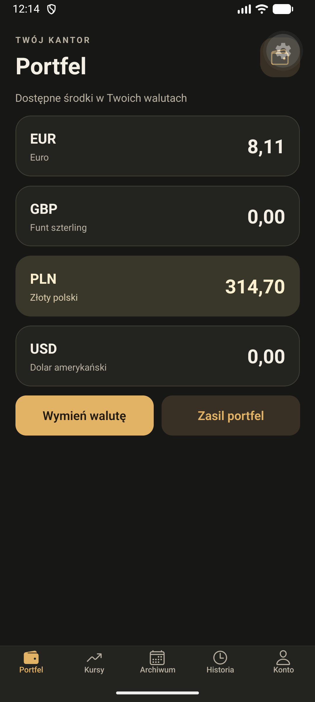
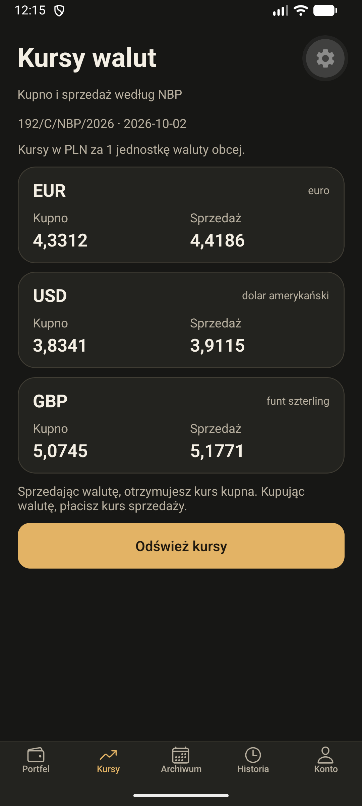
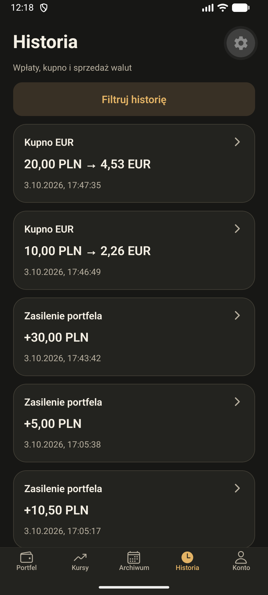
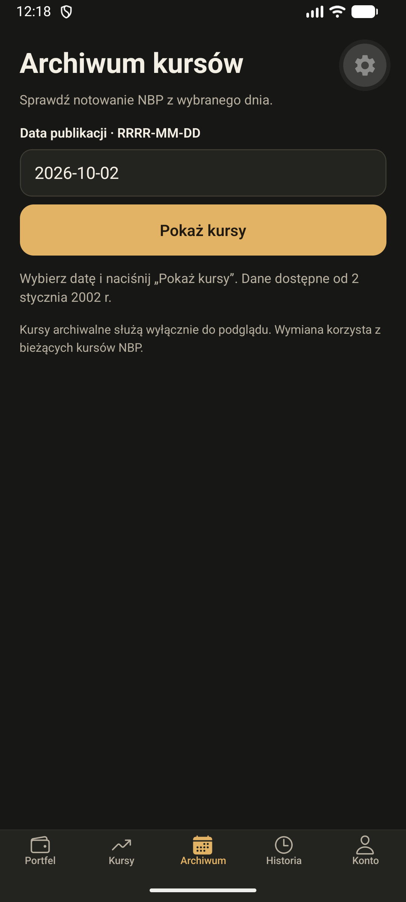
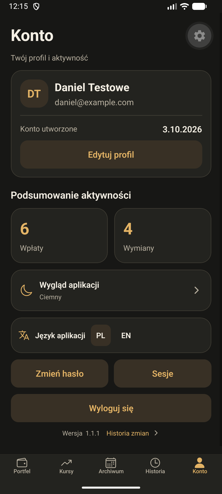
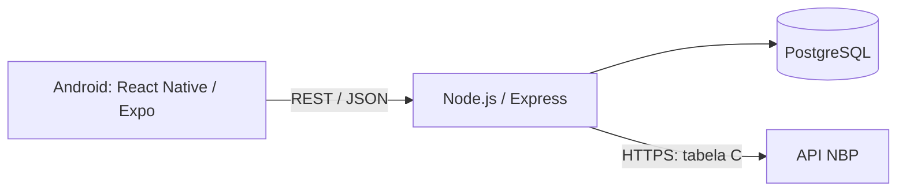

# System mobilny kantoru wymiany walut

Projekt zaliczeniowy z przedmiotu **Zagadnienia sieciowe w systemach mobilnych**. Aplikacja Android pozwala wymieniać wirtualne środki między PLN a EUR, USD i GBP, korzystając z kursów publikowanych przez Narodowy Bank Polski.

**Autor:** Daniel Świątek · **Wersja:** 1.1.1

## Podgląd aplikacji

Rzeczywiste zrzuty z emulatora Androida, wykonane w trybie ciemnym na koncie demonstracyjnym. Kwoty przedstawiają wirtualne środki; kursy na zrzutach odpowiadają dacie widocznej w aplikacji.

<table>
  <tr>
    <td align="center"><strong>Portfel</strong><br></td>
    <td align="center"><strong>Kursy NBP</strong><br></td>
    <td align="center"><strong>Historia</strong><br></td>
  </tr>
  <tr>
    <td align="center"><strong>Archiwum</strong><br></td>
    <td align="center"><strong>Konto</strong><br></td>
    <td>Aplikacja obsługuje również motyw jasny, motyw systemowy oraz język angielski.</td>
  </tr>
</table>

## Funkcjonalności

- Rejestracja, logowanie, przywracanie sesji i wylogowanie.
- Profil z imieniem, nazwiskiem, datą utworzenia konta i licznikami operacji.
- Portfel PLN/EUR/USD/GBP oraz zasilenia wirtualnymi środkami w PLN.
- Bieżące kursy kupna i sprzedaży z tabeli C NBP.
- Podgląd kursów dla wybranej daty, pobieranych na żądanie z NBP.
- Kupno i sprzedaż walut z podglądem i potwierdzeniem wyniku.
- Historia wpłat, kupna i sprzedaży: filtry daty, waluty i rodzaju operacji, strony po 20 wpisów oraz szczegóły operacji.
- Zmiana hasła i zarządzanie aktywnymi sesjami.
- Jasny, ciemny i systemowy motyw; interfejs PL/EN.
- Numer wersji i historia zmian dostępne na ekranie Konto.

Operacje są symulacją i nie wykonują rzeczywistych przelewów bankowych. Obsługiwane są wymiany PLN ↔ EUR/USD/GBP; bezpośrednia wymiana dwóch walut obcych nie jest dostępna.

## Technologie i architektura

| Warstwa | Technologie |
| --- | --- |
| Aplikacja mobilna | JavaScript, React Native 0.86, Expo SDK 57, React Navigation |
| Serwer | Node.js, Express 5, REST/JSON, Zod |
| Baza danych | PostgreSQL 17, migracje node-pg-migrate |
| Hasła i sesje | Argon2id, losowe tokeny, SHA-256 skrótu tokenu w bazie, Expo SecureStore |
| Obliczenia | decimal.js, PostgreSQL NUMERIC/DECIMAL |
| Kursy | NBP Web API, tabela C, HTTPS |
| Środowisko lokalne | Docker Compose dla bazy |
| Testy | Wbudowany runner Node.js, testy jednostkowe i integracyjne |



Salda i wynik wymiany wylicza serwer. Zmiana obu sald oraz zapis historii odbywają się w jednej transakcji bazodanowej. Blokada portfela i unikalny identyfikator żądania zabezpieczają operacje równoczesne i ponowienia.

Bieżące i archiwalne odpowiedzi NBP nie są utrwalane jako archiwum kursów. Archiwum w aplikacji jest podglądem na żądanie, a wynik znika po opuszczeniu zakładki. W bazie zachowywany jest kurs faktycznie użyty w wykonanej transakcji, niezależnie od późniejszych notowań. Do wymiany zawsze używa się bieżących kursów.

## Wymagania

- Node.js 24 i npm.
- Docker Desktop z uruchomionym silnikiem i Docker Compose.
- Telefon z Androidem i Expo Go albo emulator Androida z Android Studio.
- Dostęp do internetu dla instalacji zależności i pobierania kursów NBP.

Instrukcja zakłada terminal macOS/Linux i wykonywanie poleceń z katalogu głównego repozytorium.

## Uruchomienie lokalne

### 1. Konfiguracja środowiska

Po pobraniu repozytorium utwórz trzy lokalne pliki konfiguracyjne:

```bash
cp .env.example .env
cp server/.env.example server/.env
cp mobile/.env.example mobile/.env
```

Edytuj wartości przed uruchomieniem:

| Plik | Ustawienie |
| --- | --- |
| `.env` | `POSTGRESS_PASSWORD` — hasło użytkownika bazy; zachowaj tę nazwę, ponieważ używa jej obecny `compose.yaml`. |
| `server/.env` | `PGPASSWORD` i hasło w `DATABASE_URL` muszą odpowiadać hasłu z głównego `.env`. |
| `mobile/.env` | `EXPO_PUBLIC_API_URL` zależy od tego, czy używasz emulatora czy telefonu. |

Pliki przykładowe zawierają wyłącznie wartości demonstracyjne. Lokalnych `.env` nie dodawaj do repozytorium. Jeżeli hasło zawiera znaki specjalne, jego część w `DATABASE_URL` musi być zakodowana jako składnik URL; `PGPASSWORD` zawiera zwykłe hasło.

### 2. Baza danych

Uruchom Docker Desktop, a następnie:

```bash
docker compose up -d db
docker compose ps
docker compose exec -T db psql -U kantor -d kantor -c "SELECT current_database(), version();"
```

Baza działa na `127.0.0.1:5432`. Dane są przechowywane w wolumenie `postgres_data`.

Hasło z konfiguracji kontenera jest używane podczas pierwszej inicjalizacji bazy. Zmiana `.env` nie zmienia automatycznie hasła istniejącego użytkownika PostgreSQL.

### 3. Serwer i migracje

```bash
npm --prefix server ci
npm --prefix server run migrate:up
npm --prefix server run dev
```

Pozostaw terminal z serwerem otwarty. W drugim terminalu sprawdź:

```bash
curl http://localhost:3000/health
```

Oczekiwana odpowiedź:

```json
{"status":"ok","database":"ok"}
```

### 4. Aplikacja mobilna

Adres API ustaw w `mobile/.env`:

| Urządzenie | Przykład `EXPO_PUBLIC_API_URL` |
| --- | --- |
| Emulator Android Studio | `http://10.0.2.2:3000` |
| Fizyczny telefon | `http://192.168.1.100:3000` — zastąp IP adresem LAN swojego komputera. |

Telefon i komputer powinny być w tej samej sieci, a port 3000 dostępny dla telefonu. `localhost` na telefonie wskazuje telefon, nie komputer.

```bash
npm --prefix mobile ci
npm --prefix mobile start
```

- **Emulator:** uruchom urządzenie w Android Studio i naciśnij `a` w terminalu Expo.
- **Telefon:** otwórz Expo Go i zeskanuj kod QR.

Po zmianie `EXPO_PUBLIC_API_URL` uruchom Metro ponownie. Jeśli potrzebujesz wyczyścić jego pamięć podręczną:

```bash
npm --prefix mobile start -- --clear
```

W konfiguracji developerskiej aplikacja komunikuje się z lokalnym serwerem przez HTTP. Połączenie serwera z NBP korzysta z HTTPS. Konfiguracja HTTPS dla własnego serwera pozostaje osobnym etapem przygotowania środowiska docelowego.

## Krótka instrukcja użytkownika

1. Utwórz konto, podając imię, nazwisko, e-mail i hasło o długości 12–128 znaków. Następnie zaloguj się.
2. W **Portfelu** wybierz **Zasil portfel**, aby dodać wirtualne PLN.
3. Wybierz **Wymień walutę**, walutę obcą, kierunek i kwotę. Oblicz podgląd, sprawdź wynik i zatwierdź wymianę. Zmiana kursu wymaga nowego podglądu.
4. W **Kursach** sprawdź bieżące notowania. Kupując walutę, płacisz kurs sprzedaży `ask`; sprzedając ją, otrzymujesz kurs kupna `bid`. Kwoty wynikowe są zaokrąglane do dwóch miejsc metodą ROUND_HALF_UP.
5. W **Archiwum** wpisz datę `RRRR-MM-DD`. Brak notowania, np. w weekend, jest sygnalizowany komunikatem.
6. W **Historii** wybierz filtry lub dotknij operacji, aby zobaczyć szczegóły. Przycisk **Pokaż starsze operacje** pobiera następną stronę.
7. W **Koncie** edytuj profil, wybierz motyw i język, zmień hasło lub zakończ sesje. Zmiana hasła kończy inne sesje; zakończenie wszystkich sesji wylogowuje również tę aplikację.
8. Dotknij informacji o wersji w Koncie, aby otworzyć historię zmian.

Niepewny wynik wpłaty lub wymiany po utracie połączenia należy sprawdzić przez ponowienie oczekującej operacji. Aplikacja zachowuje jej identyfikator, aby uniknąć podwójnego wykonania.

## Testy

```bash
npm --prefix server test
npm --prefix mobile test
npm --prefix server run test:integration
```

Zweryfikowany zestaw: **26 testów serwera z testami integracyjnymi oraz 17 testów logiki mobilnej**. Testy integracyjne wymagają działającej bazy i migracji; serwer testowy startuje sam na losowym porcie. Testy mobilne zastępują natywne moduły i sieć, więc nie potwierdzają wyglądu na urządzeniu.

Szczegółowy zakres, wymagania i lista kontroli ręcznej: [TESTING.md](TESTING.md).

## Struktura repozytorium

```text
.
├── mobile/                 # Aplikacja React Native / Expo
│   ├── src/components/     # Formularze i elementy interfejsu
│   ├── src/screens/        # Ekrany aplikacji
│   ├── src/navigation/     # Dolna nawigacja
│   ├── src/services/       # HTTP, tokeny, oczekujące operacje
│   ├── src/i18n/           # PL/EN
│   ├── src/theme/          # Motywy kolorystyczne
│   ├── src/config/         # Historia wersji
│   └── tests/              # Testy logiki mobilnej
├── server/
│   ├── src/modules/        # Auth, profil, portfel, wymiana, kursy, historia
│   ├── migrations/         # Schemat bazy i waluty początkowe
│   └── tests/              # Testy jednostkowe i integracyjne
├── diagramy/               # UML, ERD i architektura
├── docs/screenshots/       # Zrzuty z emulatora
├── compose.yaml            # PostgreSQL
├── Dokumentacja_projektowa.docx
└── TESTING.md
```

## Najczęstsze problemy

| Problem | Co sprawdzić |
| --- | --- |
| `docker: command not found` na macOS | Instalację Docker Desktop i dostępność jego CLI w PATH. |
| `password authentication failed` | Zgodność `PGPASSWORD`, `DATABASE_URL` i rzeczywistego hasła istniejącej bazy. |
| Aplikacja nie łączy się z API | Działanie `/health`, właściwy adres dla urządzenia, sieć i dostępność portu 3000. |
| Nie można sprawdzić sesji | Czy PostgreSQL i serwer działają; uruchom bazę i ponów próbę. |
| Brak archiwalnego kursu | Czy NBP opublikował tabelę C w wybranym dniu; spróbuj dnia roboczego. |
| Metro nie widzi zainstalowanego modułu | Wykonaj `npm --prefix mobile ci`, a następnie uruchom Expo z `--clear`. |

## Źródła

- [NBP Web API](https://api.nbp.pl/) — bieżące i archiwalne tabele kursów.
- [Expo SDK 57](https://docs.expo.dev/versions/v57.0.0/).
- [React Native](https://reactnative.dev/docs/getting-started).
- [React Navigation](https://reactnavigation.org/docs/getting-started).
- [PostgreSQL 17](https://www.postgresql.org/docs/17/index.html).
- [Node.js](https://nodejs.org/api/).
